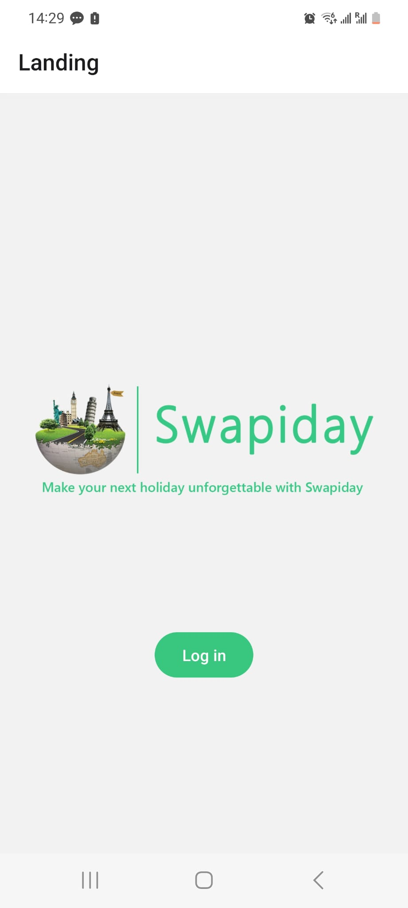
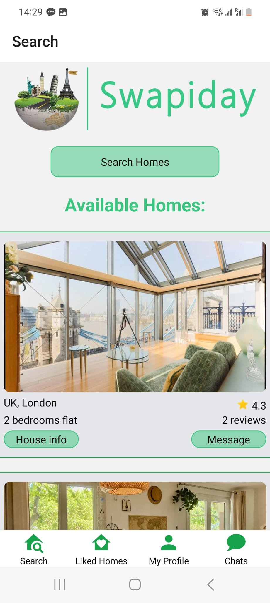
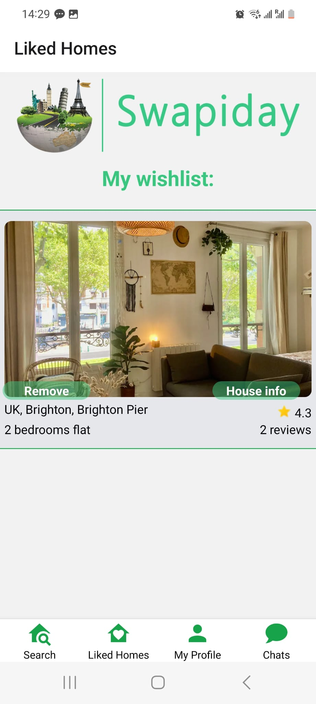
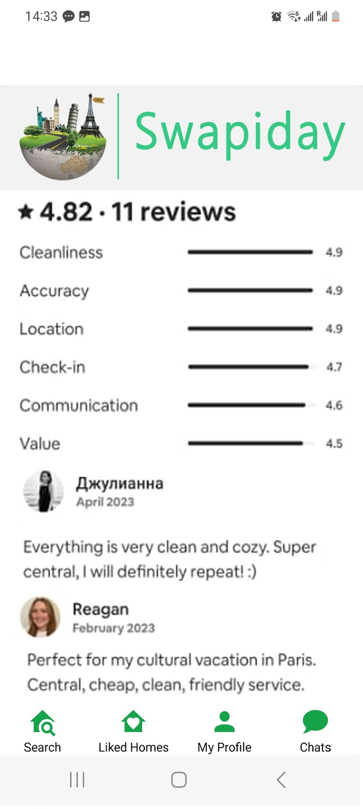
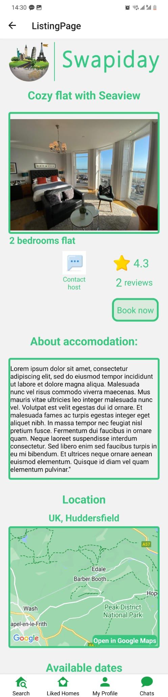
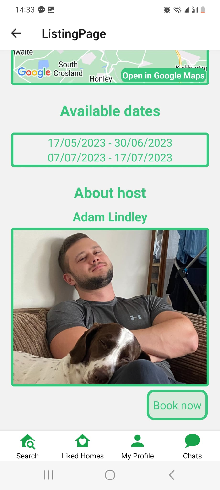
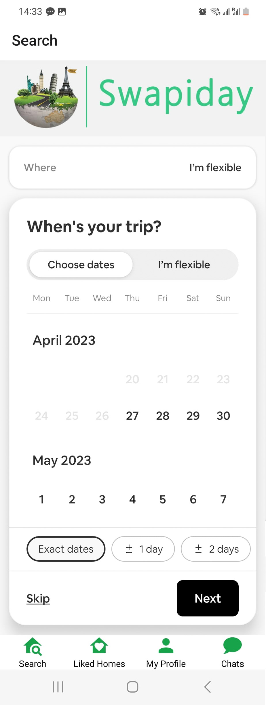
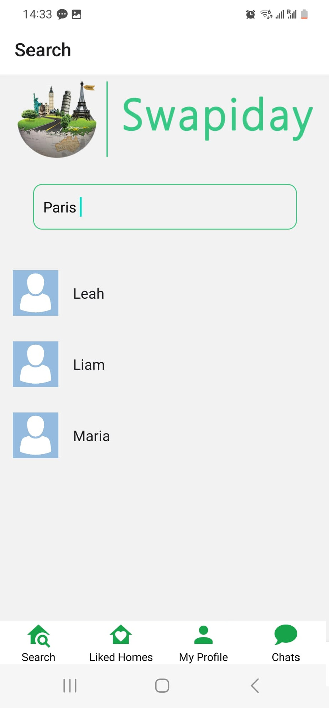

# 

Swapiday is a mobile application that allows travellers to swap their holiday homes with others for free. It helps users save money on accommodations and provides an opportunity to explore different cities and countries.

## Table of Contents

- [Introduction](#introduction)
- [Features](#features)
- [Tech Stack](#tech-stack)
- [Installation](#installation)
- [Usage](#usage)
- [Video Presentation](#video-presentation)
- [Screenshots](#screenshots)
- [Contributing](#contributing)
- [License](#license)

## Introduction

Many travellers face the challenge of finding affordable accommodations while visiting new cities. Swapiday aims to solve this problem by providing a platform for users to exchange their homes with other travelers for the duration of their holiday. This allows users to save money on accommodations and explore new destinations.

This repository contains the source code for the Swapiday mobile application, built using JavaScript and React Native with Expo. The backend is powered by Firebase, providing a secure and scalable infrastructure for user management and data storage.

## Features

- Browse a list of available houses sorted by rating and positive reviews.
- Use the search option to find houses based on your desired destination and dates.
- View detailed information about each house, including a description, photo gallery, and location on a map.
- Explore the host's profile and connect with them through the in-app chat feature.
- Create a new user account or log in to an existing one.
- Leave reviews and ratings for houses and their owners.
- Easily manage your account, including deleting your account if needed.

## Tech Stack

-  React Native (Frontend)
-  Firebase (Backend)
-  Expo
-  JavaScript

## Installation

To run the Swapiday app locally, follow these steps:

1.  Clone this repository to your local machine.
2.  Install Node.js and npm if you haven't already.
3.  Install Expo CLI globally by running `npm install -g expo-cli`.
4.  Navigate to the project's root directory and run `npm install` to install the dependencies.
5.  Set up a Firebase project and obtain your Firebase configuration details.
6.  Create a `.env` file in the root directory and add your Firebase configuration as environment variables. For example:

            // .env file

            API_KEY=your-api-key
            AUTH_DOMAIN=your-auth-domain
            PROJECT_ID=your-project-id
            ...

7.  Run `npx expo start` to start the Expo development server. If you encounter any connection issues, you can try running `npx expo start --tunnel`. This option sets up a secure tunnel to your local development server, which can help with network connectivity on certain computers.
8.  Scan the QR code with the Expo Go app on your mobile device or use an Android/iOS emulator to launch the app.

## Usage

Once the Swapiday app is running, you can navigate through the various screens to browse available houses, search for specific destinations, view house details, interact with hosts, and manage your account.

Feel free to explore the app's functionality and provide feedback or report any issues through GitHub's issue tracking system.

## Video Presentation

Check out our video presentation to get a closer look at Swapiday:

[)](https://youtu.be/Wwwftd60e6k)

## Screenshots

Here are some screenshots of the Swapiday app:

  
  
  
  

  
  
  
  

#

## Swapiday was created by BYTE-BANDITS team as the final project for the Northcoders bootcamp, May 2023.
